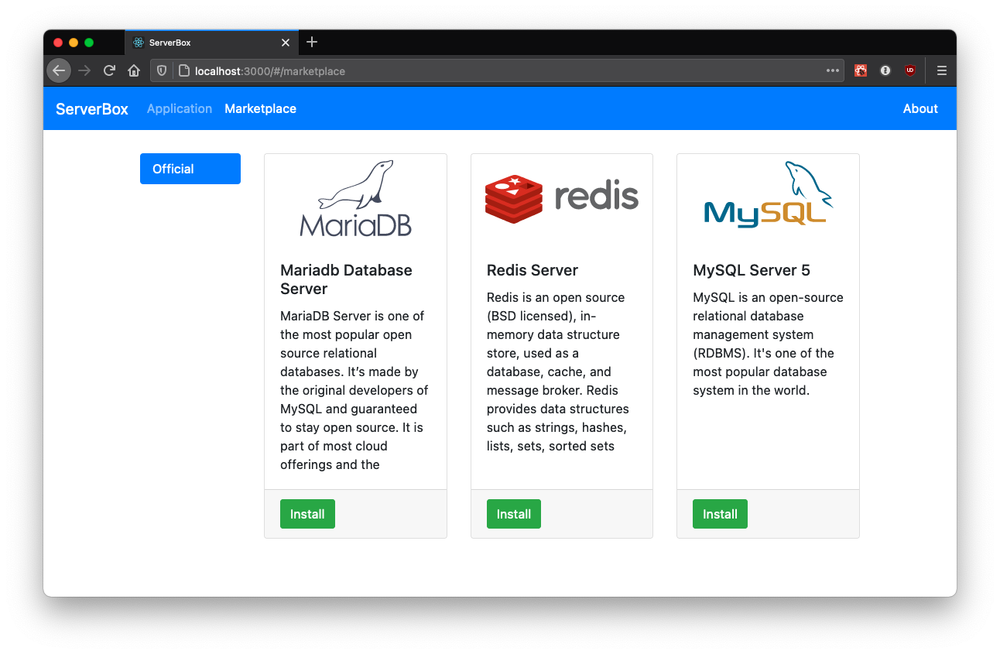

# ui
The web ui for ServerBox application engine. Written in React.js + BootStrap.
# Screenshots


# Usage
```shell
npm install
export REACT_APP_API_SERVER=http://localhost:8000 # Change to your core API server.
npm start
```
# TODO
- Application Page
  - List all applications
  - Show the detail of each application.
- Marketplace Page
    - Add / remove other marketplaces.
    - Search in marketplaces.